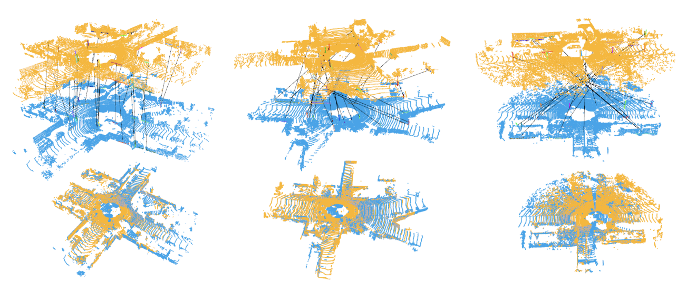

# SuperLine3D

> SuperLine3D: Self-supervised Line Segmentation and Description for LiDAR Point Cloud  
> Xiangrui Zhao, Sheng Yang, Tianxin Huang, Jun Chen, Teng Ma, Mingyang Li and Yong Liu  
> ECCV 2022 Poster



## TODO List and ETA
- [x] Code for training on synthetic and real data, and the synthetic data preparation scripts (2022-7-21).

- [ ] Evaluation code and metrics (expected 2022-8-21).


## Requirements
Our code was tested using Tensorflow 1.15.5 and Python 3.8. To use the code, you need to first install the following python packages:

  ```Shell
  pip install tensorflow-gpu==1.15.5 h5py open3d tqdm visdom multiprocessing Geometry3D
  pip install git+https://github.com/utiasSTARS/liegroups.git
  ```

## How to Use

### Step 1. Train on Synthetic Data
<!-- <details>
  <summary>Step 1. Train on Synthetic Data</summary> -->

```bash
# Generate synthetic data
cd scripts
python generate_synthetic_pc.py synthetic_data/

# Train on synthetic data
cd ..
python train_synthetic_data.py --load_folder  scripts/synthetic_data/line_pole_noise/  
```
<!-- </details> -->


### Step 2. Train on Labeled Lidar Data
Download labeled Lidar data from [Google Drive](https://drive.google.com/file/d/1zFnez6jERWH3zlIFxuJASiJUFiK04o77/view?usp=sharing)  
Change **batch_size** according to your VRAM. It must be **even**.
<!-- <details>
  <summary>Step 1. Train on Synthetic Data</summary> -->

```bash
python train_superline3d.py --loader_folder <path to your train data>/kitti_reg_diff35/
```
<!-- </details> -->


### Step 3. Inference on Kitti Test Data
Download test Lidar data from [Google Drive](https://drive.google.com/file/d/1ZritaoKOynMZ29QBFmijEkxT65MKpSE_/view?usp=sharing)
<!-- <details>
  <summary>Step 1. Train on Synthetic Data</summary> -->

```bash
python inference_superline3d.py --load_folder  <path to your data>/kitti_reg_test_diff5_2w5/ --pred_path <save path> --best_model xxx.ckpt  
```
<!-- </details> -->


## Citation

```bibtex
@inproceedings{zhao2022superline3d,
  title={SuperLine3D: Self-supervised Line Segmentation and Description for LiDAR Point Cloud},
  author={Zhao, Xiangrui and Yang, Sheng and Huang, Tianxin and Chen, Jun and Ma, Teng and Li, Mingyang and Liu, Yong},
  booktitle={European Conference on Computer Vision},
  year={2022},
  organization={Springer}
}
```

## Acknowledgments
This code benefits from [DGCNN](https://github.com/WangYueFt/dgcnn.git) and [ASIS](https://github.com/WXinlong/ASIS) .